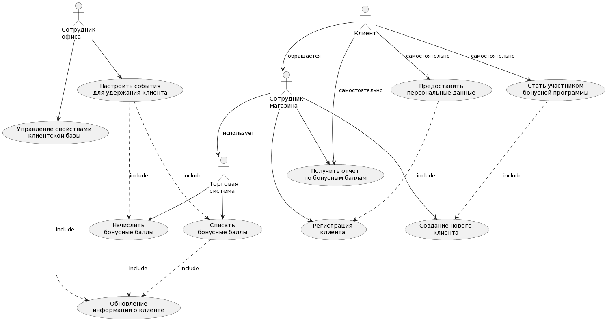
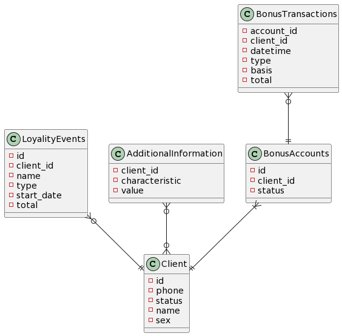

## Предметная область

Бонусная система компании. Верифицированная клиентская база.
 
## Задачи системы

Основной задачей является предоставление возможности начисления и списания бонусных балов для клиента компании, получение и накопление информации о клиенте, категоризация клиентской базы.

Основной фукнционал:
- Создание нового (обезличенного) клиента по номеру телефона;
- Регистрация клиента - первичный сбор данных о клиенте;
- Создание произвольных характеристик (свойств) клиентской базы, детализирующих информацию о каждом клиенте;
- Начисление бонусных баллов за различные события - покупка, день рожденья и т.д.;
- Списание бонусных баллов по запросу как от клиента, так и по решению компании;
- Предоставление отчета по остатку и движению бонусных баллов клиента;
- Создание произвольных тригеров по движению или обороту на бонусном счету клиента либо по его остатку на определенный момент времени для изменения свойств каждого конктретного клиента (категоризация);

## Архитектура системы

Клиент-серверная архитектура.

Общий backend для для двух разных клиентов - мобильное приложение и web-приложение. Так же часть API предоставляется для функций торговой системы.

Архитектура web-приложения - SPA, фреймворк Vue JS.
Архитектурный стиль backend - REST API, фреймворк FastAPI (python).

БД для хранение клиентской базы - MongoDB.
БД для хранения бонусных баллов - MySQL.

Асихнронная запись операций по бонусным баллам через брокер сообщений - RabbitMQ.

## Use-Case диаграма

## ER диаграма

